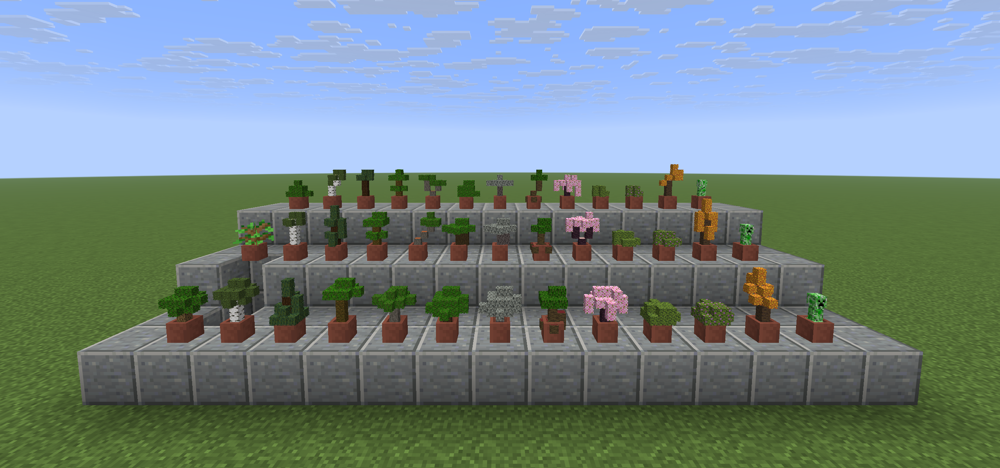

# Bonsai Saplings

A Fabric mod that turns a sapling in a flower pot into a little tree.

## Screenshots

## What This Mod Does

Put a sapling in a pot and it grows, at pot size. Sneak and cut it back with shears and it comes up as a
different shape.

The sapling itself goes out of sight once the tree is up. A potted sapling is a block that draws a
sapling, and a sapling poking up through a trunk is the one thing that stops a bonsai reading as a
tree, so the pot is emptied and the tree becomes the record of what was planted. It behaves like a
full pot all the same: a plant offered to it is refused, an empty hand takes the tree out and hands
the sapling back, and breaking the pot drops the sapling with it.

## The Shapes

Three for each kind of sapling, drawn after the tree that sapling grows into. A birch is tall and
thin with a small head high up; a spruce is a cone; a jungle tree is a bare trunk with everything at
the top; an acacia is a flat pad on a bent trunk, or two pads; a dark oak is squat under a head far
wider than its trunk; a mangrove stands up on its roots; a cherry hangs a wide head past its own
trunk; an azalea is a bush with hardly any trunk. Pale oak grows like dark oak, flowering azalea
like azalea, and a sapling nobody has drawn for grows like an oak.

Chunky on purpose. A cell is a sixth of a block and the soil in a pot is a quarter, so there is no
room at this size for the finesse of a real bonsai. These are drawn the way Minecraft draws each
tree, in blobs that read as that tree from across a room, and nothing goes below the soil, because
the pot is standing on something.

**Sneaking shears step through them in order**: the four quarter turns of the form the tree is
wearing, then the next form, then round again. A tree that should face the window can be turned to
face it and left there; twelve cuts bring it back to where it started. A pot grown fresh starts on a
form and a turn chosen at random.

The wood and leaves are the species' own, worked out from the potted block's name: a potted birch
sapling grows birch. A wood set added next version needs no edit here. Only the game's own blocks
are looked up, so a sapling from another mod stays an ordinary potted sapling. Poplar, mangrove, azalea and
flowering azalea are named individually, being the four that do not follow the rule.

Four potted things that are not saplings grow too. Bamboo is a grove of canes with their fronds,
at different heights, or one tall cane, or one bent over. The red and brown mushrooms grow as the
huge ones, a stem under a cap: a toadstool, a flat plate, or two together. The crimson and warped
fungi grow as the huge fungi of the nether, a tall stem under a cap of wart: straight, bent, or
twinned. Their caps and canes are solid or thin enough to need no block behind them.

A cactus grows a saguaro: two-armed, a column, or a cluster. A dead bush grows deadwood, the
style bonsai began with, a bleached trunk with hardly anything on it: windswept, cascading over
the rim, or a broken snag.

Three things the game never potted grow here too, planted straight into an empty pot with the
item in hand and handed back when the pot is emptied or broken. A chorus flower grows the End's
forking tree with a flower on every tip. A handful of grass grows a tray of it on a bed of moss,
the wheatgrass in a juice bar's window. Any seed grows a tray of starts on a bed of soil, the
seedlings kept at their first true leaves for good.

The tall flowers - sunflower, lilac, rose bush, peony and pitcher plant - are planted the same
way, the flower itself into an empty pot. Each grows as its two halves, stalk under bloom: a
clump, one on a long stem, or three in a row.

Trailing plants grow the way a pothos does, a mound in the pot with strands spilling over the
rim: vines on a bed of moss, weeping vines on crimson nylium, and glow berries as cave vines
carrying their berries, all planted straight into an empty pot. In a flower pot they spill just
over the edge, all round, to one side, or heaped; in a cachepot they hang the whole way down the
decorated pot, a curtain all round or a cascade down one face.

## The Cachepot

A flower pot put inside a decorated pot, the ordinary way a decorated pot takes things, makes it
a cachepot, and a cachepot is planted like a flower pot: the same saplings, fungi, flowers and
seeds, straight in. What grows there has the room a flower pot never had. Every kind has two
larger forms that only a cachepot grows - an oak with a full crown on branches, a spruce three
tiers high, a jungle giant on four trunks, a thicket of bamboo, a bouquet of sunflowers - and it
starts on one of them. Sneaking shears step through the small forms and the large. An empty
hand takes the plant out and hands it back, and the flower pot stays in the decorated pot.

A flower pot set on top of a decorated pot has the same room, since from outside the two look
alike: a flower pot inside a decorated pot is not drawn at all. What it grows stands in the flower
pot, and its forms are the cachepot's.

With [better-trees](../better-trees) on the server the canopy is finished the way it finishes a
grown tree: the outermost leaves become that species' leaf stairs, stepping down and outward,
with the underside turned over and the corners cut. The rule is theirs and the blocks are looked
up by name, so nothing here depends on it, and a world without it grows the same trees in cubes.

## The Creeper

A creeper has always been half topiary: a green thing on four legs that turns up in a garden
uninvited. **Right-click an empty flower pot with a creeper spawn egg** and you get the shape
without the consequences.

It is a real creeper, shrunk to the height of the trees, because nothing built out of blocks at
this size read as one. What makes it furniture is everything taken away from it: it does not
think, move, hiss, take damage, or answer to flint and steel, a lead or a name tag; it stays
through peaceful difficulty; and you can sleep next to it. Sneaking shears turn it a quarter,
since it has only the one shape. An empty hand takes it out of the pot and hands the egg back,
and so does breaking the pot.

An empty pot only. A pot with a tree in it is somebody's tree, and quietly replacing it is not what
anybody holding a spawn egg over it meant.

It is never rolled at random and shears never turn a tree into one. A creeper you did not plant is
a surprise of the wrong kind.

## How It Is Drawn

Block displays, one per block of the form. A display carries a full transformation and a block does
not, and the whole point is a tree at a fraction of block size - nothing actually made of blocks can
be smaller than one.

Every leaf gets a second, slightly smaller display inside it: a solid block in the colour of a
canopy's shade. A leaf texture is mostly holes, and at this size the holes in a leaf's front and
back faces line up, so without the backing you looked straight through the foliage to whatever
was behind the pot; a birch, with the holiest leaves and a white trunk, came out bleached. The
leaves keep their own colours - the game's own birch olive, spruce blue-green, and the plain
foliage green for the rest - and the backing only darkens the holes.

Those displays are also the only record. Nothing stores which pots have trees in them; the trees
sitting in them do. Vanilla clients see everything, because a block display is vanilla.

## Catching Up

A pot filled before this was installed, or one whose tree somebody removed, grows one the first
time a player reaches for it. There is deliberately no chunk-load sweep: planting means spawning
entities and asking what entities are nearby, and neither belongs anywhere near chunk loading.

## Development

Installing and the map of the source are in [DEVELOPMENT.md](DEVELOPMENT.md).

## License

MIT, see [LICENSE](LICENSE).
